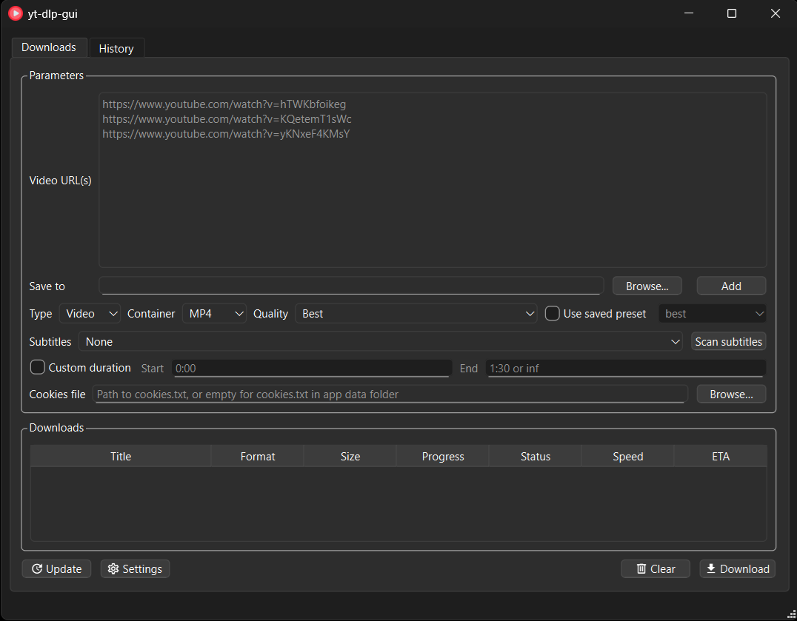

# yt-dlp-gui

A desktop GUI for [yt-dlp](https://github.com/yt-dlp/yt-dlp) (Python + PySide6/Qt). Supports
any site yt-dlp supports, multi-video downloading with a configurable concurrency limit,
playlist/channel selection, file type / container / quality selection, custom duration
clips, subtitle selection, a persistent download history with re-download, and one-click
`yt-dlp -U` self-update.

Maintained by [Aerilon1](https://github.com/Aerilon1). This is a rewrite based on
[dsymbol/yt-dlp-gui](https://github.com/dsymbol/yt-dlp-gui) (archived).

Compared to the original, this build adds **per-video quality / container selection**
(not just fixed presets) and **subtitle scanning and selection** (manual or auto
captions, with options baked into each queue item).



## Usage

There are two ways to get started:

* [Portable](#portable) — Windows ZIP (no Python install needed for the GUI)
* [From source](#from-source) — any platform with Python

### Requirements (both)

These must be installed and available on `PATH`:

- [ffmpeg](https://ffmpeg.org/) (including `ffprobe`)
- [yt-dlp](https://github.com/yt-dlp/yt-dlp)
- Optionally [Deno](https://deno.com/), Node, or Bun — used for YouTube's JS "n challenge"
  when needed; the app detects and uses whichever is on `PATH`.

The app checks for `ffmpeg`/`ffprobe`/`yt-dlp` on startup and refuses to launch if any are
missing. From-source runs also need **Python 3.11+**.

### Portable

Download `yt-dlp-gui-win64.zip` from the
[latest release](https://github.com/Aerilon1/yt-dlp-gui/releases/latest).

1. Extract the ZIP
2. Run `yt-dlp-gui\yt-dlp-gui.exe`

Config, cookies, history, and logs are stored under `%APPDATA%\yt-dlp-gui` — not inside the
extracted folder — so you can replace the portable build without losing settings.

### From source

```powershell
git clone https://github.com/Aerilon1/yt-dlp-gui.git
cd yt-dlp-gui
pip install -r requirements-dev.txt
python main.py
```

## Tests

```powershell
python -m pytest
```

Tests cover pure logic only (format-argv building, config load/save, history storage,
progress-line parsing, the concurrency dispatcher) -- no UI/integration tests.

## Building a distributable

```powershell
.\build.ps1
```

Builds a one-folder PyInstaller bundle into `dist/yt-dlp-gui/` using an isolated build
venv, then creates `yt-dlp-gui-win64.zip` (same layout as the original project's portable
release). Optionally also install locally:

```powershell
.\build.ps1 -InstallDir "C:\Program Files\yt-dlp-gui"
```

## User data

Config, cookies, and download history are never stored alongside the source/install
folder -- they always live under `%APPDATA%\yt-dlp-gui` (config.toml, cookies.txt,
history.sqlite3, logs/), created automatically on first run.

## Project layout

```
main.py                    Entry point (PyInstaller shim)
src/yt_dlp_gui/
  models/                  Plain-dataclass domain model (DownloadItem, FormatSpec, ...)
  services/                Config, paths, dependency checks, the download engine
                            (subprocess/QThread execution + concurrency-gated dispatcher),
                            probing (subtitles/formats/playlists), history storage
  ui/                      PySide6 widgets and the main window
  resources/               Bundled icon + default (no-personal-data) config template
tests/                     pytest suite for the modules above
build/yt-dlp-gui.spec      PyInstaller spec
```

## Credits

Based on [dsymbol/yt-dlp-gui](https://github.com/dsymbol/yt-dlp-gui). Credits from the
original project:

- [dsymbol](https://github.com/dsymbol) — dsymbol
- [viralarchitect](https://github.com/viralarchitect) — Nicholas King
- [rajeshsub](https://github.com/rajeshsub) — Rajesh Subramanian
- [Renaud-Barrau](https://github.com/Renaud-Barrau) — Renaud

## License

This project is released under the [Unlicense](LICENSE) (public domain), matching the
original project.
